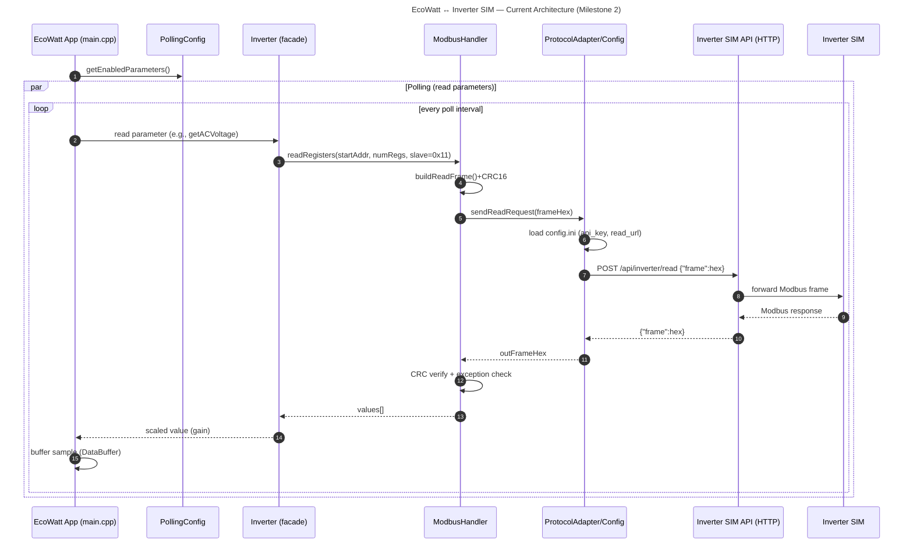

# EcoWatt - Inverter Communication System - Milestone 2

A modular and flexible system for communicating with solar inverters.

## 📋 Requirements

### Software Dependencies

- **C++11** or higher compiler (g++)
- **libcurl** development libraries
- **Make** build system

### Installation of Dependencies

#### macOS (using Homebrew)

```bash
brew install curl
```

#### Ubuntu/Debian

```bash
sudo apt-get update
sudo apt-get install libcurl4-openssl-dev build-essential
```

## 🚀 Quick Start

### 1. Clone

```bash
git clone https://github.com/BitBots-EcoWatt-Device/Milestone_2.git
cd Milestone_2
```

### 2. Configure the System

Ensure the `config.ini` file is properly configured with your API credentials:

```ini
[API]
api_key=YOUR_API_KEY_HERE

[ENDPOINTS]
read_url=http://your-api-endpoint/api/inverter/read
write_url=http://your-api-endpoint/api/inverter/write

[DEVICE]
default_slave_address=0x11
```

### 3. Run the Application

```bash
make run
```

## 🔧 Build System

### Available Make Targets

```bash
make clean          # Clean build artifacts
make main          # Build main application
make tests         # Build test suite
make run           # Build and run main application
make test          # Build and run tests
make all           # Build both main and tests, then run main
```

## 🧪 Testing

### Running Tests

```bash
make test
```

### Test Coverage

- Invalid Modbus frames
- Read-only register write attempts
- Malformed API responses
- Configuration file validation

## 🔬 Architecture Details

### Modular Design

The system follows a layered architecture:

1. **Application Layer** (`main.cpp`): User interface and application logic
2. **Inverter Layer** (`Inverter.cpp`): High-level device abstraction
3. **Protocol Layer** (`ModbusHandler.cpp`): Modbus protocol implementation
4. **Communication Layer** (`ProtocolAdapter.cpp`): HTTP API interface
5. **Configuration Layer** (`Config.cpp`): Settings management

### Data Flow


